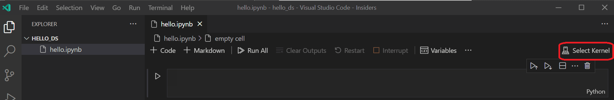
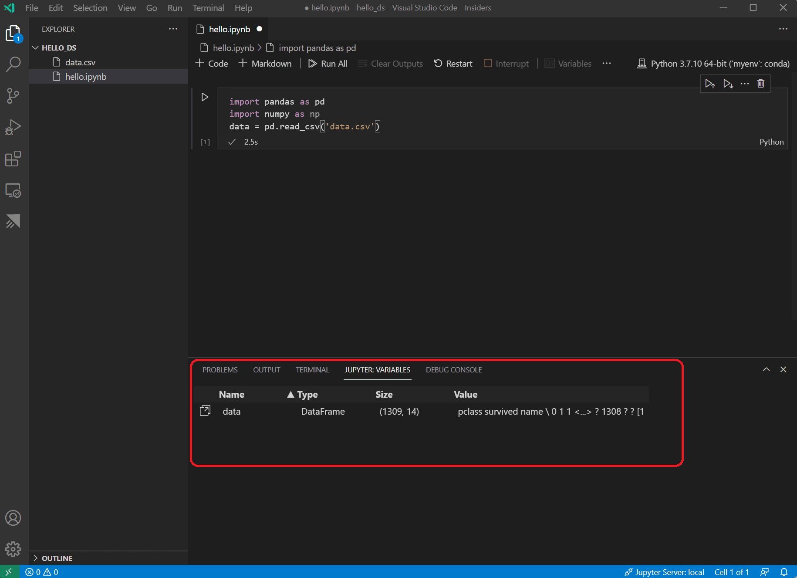
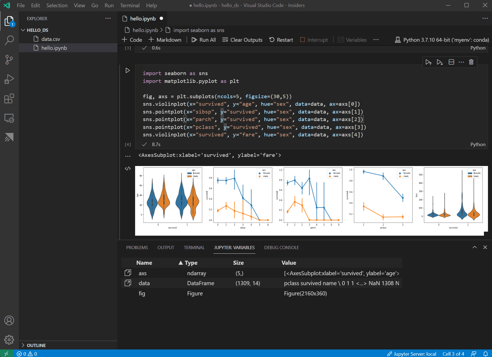
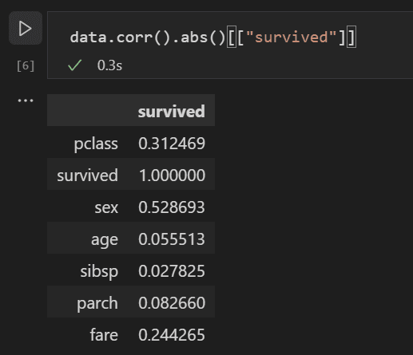
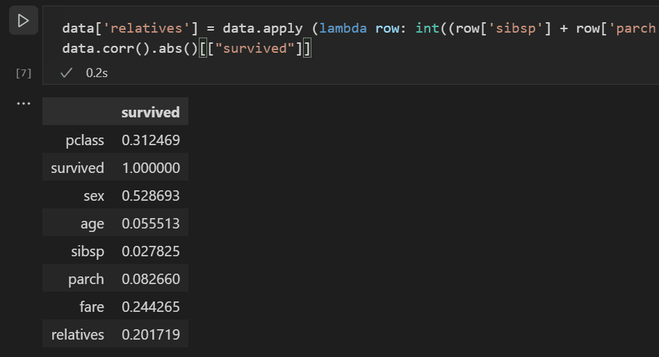
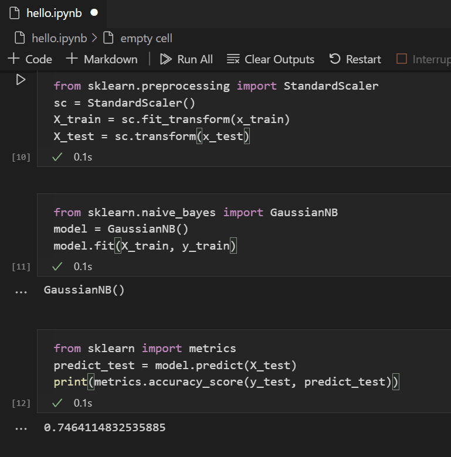
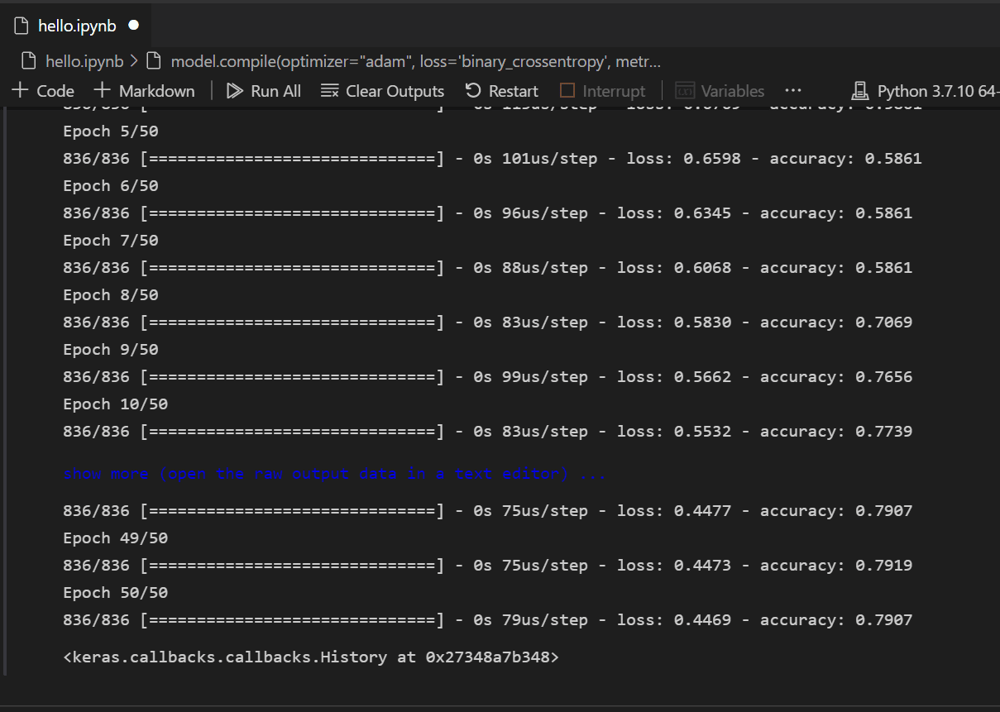
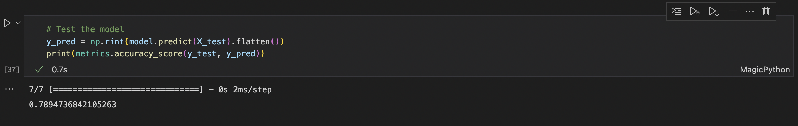

https://code.visualstudio.com/docs/datascience/data-science-tutorial


# Python and Data Science Tutorial in Visual Studio Code

In this article

This tutorial demonstrates using Visual Studio Code and the Microsoft Python extension with common data science libraries to explore a basic data science scenario. Specifically, using passenger data from the Titanic, you will learn how to set up a data science environment, import and clean data, create a machine learning model for predicting survival on the Titanic, and evaluate the accuracy of the generated model.

## Prerequisites

The following installations are required for the completion of this tutorial. Make sure to install them if you haven't already.

* Visual Studio Code

* The Python extension for VS Code and Jupyter extension for VS Code from the Visual Studio Marketplace. For more details on installing extensions, see Extension Marketplace. Both extensions are published by Microsoft.

* Miniconda with latest Python

        Note: If you already have the full Anaconda distribution installed, you don't need to install Miniconda. Alternatively, if you'd prefer not to use Anaconda or Miniconda, you can create a Python virtual environment and install the packages needed for the tutorial using pip. If you go this route, you will need to install the following packages: pandas, jupyter, seaborn, scikit-learn, keras, and tensorflow.

## Set up a data science environment

Visual Studio Code and the Python extension provide a great editor for data science scenarios. With native support for Jupyter notebooks combined with Anaconda, it's easy to get started. In this section, you will create a workspace for the tutorial, create an Anaconda environment with the data science modules needed for the tutorial, and create a Jupyter notebook that you'll use for creating a machine learning model.

1. Begin by creating an Anaconda environment for the data science tutorial. Open an Anaconda command prompt and run conda create -n myenv python=3.10 pandas jupyter seaborn scikit-learn keras tensorflow to create an environment named myenv. For additional information about creating and managing Anaconda environments, see the Anaconda documentation.

```
conda create -n myenv python=3.10 pandas jupyter seaborn scikit-learn keras tensorflow
```


2. Next, create a folder in a convenient location to serve as your VS Code workspace for the tutorial, name it hello_ds.

3. Open the project folder in VS Code by running VS Code and using the File > Open Folder command. You can safely trust opening the folder, since you created it.

4. Once VS Code launches, create the Jupyter notebook that will be used for the tutorial. Open the Command Palette (⇧⌘P) and select Create: New Jupyter Notebook.


        Note: Alternatively, from the VS Code File Explorer, you can use the New File icon to create a Notebook file named hello.ipynb.

5. Save the file as hello.ipynb using File > Save As....

6. After your file is created, you should see the open Jupyter notebook in the notebook editor. For additional information about native Jupyter notebook support, you can read the Jupyter Notebooks topic.


7. Now select Select Kernel at the top right of the notebook.



8. Choose the Python environment you created above in which to run your kernel.


9. To manage your environment from VS Code's integrated terminal, open it up with (⌃`). If your environment is not activated, you can do so as you would in your terminal (conda activate myenv).

## Prepare the data

This tutorial uses the Titanic dataset available on OpenML.org, which is obtained from Vanderbilt University's Department of Biostatistics at https://hbiostat.org/data. The Titanic data provides information about the survival of passengers on the Titanic and characteristics about the passengers such as age and ticket class. Using this data, the tutorial will establish a model for predicting whether a given passenger would have survived the sinking of the Titanic. This section shows how to load and manipulate data in your Jupyter notebook.

1. To begin, download the Titanic data from hbiostat.org as a CSV file (download links in the upper right) named titanic3.csv and save it to the hello_ds folder that you created in the previous section.

2. If you haven't already opened the file in VS Code, open the hello_ds folder and the Jupyter notebook (hello.ipynb), by going to File > Open Folder.

3. Within your Jupyter notebook, begin by importing the pandas and numpy libraries, two common libraries used for manipulating data, and loading the Titanic data into a pandas DataFrame. To do so, copy the code below into the first cell of the notebook. For more guidance about working with Jupyter notebooks in VS Code, see the Working with Jupyter Notebooks documentation.

```
import pandas as pd
import numpy as np
data = pd.read_csv('titanic3.csv')
```

4. Now, run the cell using the Run cell icon or the Shift+Enter shortcut.


5. After the cell finishes running, you can view the data that was loaded using the Variables Explorer and Data Viewer. First select the Variables icon in the notebook's upper toolbar.


6. A JUPYTER: VARIABLES pane will open at the bottom of VS Code. It contains a list of the variables defined so far in your running kernel.



7. To view the data in the Pandas DataFrame previously loaded, select the Data Viewer icon to the left of the data variable.


8. Use the Data Viewer to view, sort, and filter the rows of data. After reviewing the data, it can then be helpful to graph some aspects of it to help visualize the relationships between the different variables.


9. Before the data can be graphed, you need to make sure that there aren't any issues with it. If you look at the Titanic csv file, one thing you'll notice is that a question mark ("?") was used to identify cells where data wasn't available.

    While Pandas can read this value into a DataFrame, the result for a column like age is that its data type will be set to object instead of a numeric data type, which is problematic for graphing.

    This problem can be corrected by replacing the question mark with a missing value that pandas is able to understand. Add the following code to the next cell in your notebook to replace the question marks in the age and fare columns with the numpy NaN value. Notice that we also need to update the column's data type after replacing the values.

        Tip: To add a new cell you can use the insert cell icon that's in the bottom left corner of an existing cell. Alternatively, you can also use the Esc to enter command mode, followed by the B key.

```
data.replace('?', np.nan, inplace= True)
data = data.astype({"age": np.float64, "fare": np.float64})
```

        Note: If you ever need to see the data type that has been used for a column, you can use the DataFrame dtypes attribute.

10. Now that the data is in good shape, you can use seaborn and matplotlib to view how certain columns of the dataset relate to survivability. Add the following code to the next cell in your notebook and run it to see the generated plots.

```
    import seaborn as sns
    import matplotlib.pyplot as plt

    fig, axs = plt.subplots(ncols=5, figsize=(30,5))
    sns.violinplot(x="survived", y="age", hue="sex", data=data, ax=axs[0])
    sns.pointplot(x="sibsp", y="survived", hue="sex", data=data, ax=axs[1])
    sns.pointplot(x="parch", y="survived", hue="sex", data=data, ax=axs[2])
    sns.pointplot(x="pclass", y="survived", hue="sex", data=data, ax=axs[3])
    sns.violinplot(x="survived", y="fare", hue="sex", data=data, ax=axs[4])
```



    
        Tip: To quickly copy your graph, you can hover over the upper right corner of your graph and click on the Copy to Clipboard button that appears. You can also better view details of your graph by clicking the Expand image button.


11. These graphs are helpful in seeing some of the relationships between survival and the input variables of the data, but it's also possible to use pandas to calculate correlations. To do so, all the variables used need to be numeric for the correlation calculation and currently gender is stored as a string. To convert those string values to integers, add and run the following code.

```
    data.replace({'male': 1, 'female': 0}, inplace=True)
```

12. Now, you can analyze the correlation between all the input variables to identify the features that would be the best inputs to a machine learning model. The closer a value is to 1, the higher the correlation between the value and the result. Use the following code to correlate the relationship between all variables and survival.

```
    data.corr(numeric_only=True).abs()[["survived"]]
```



    
13. Looking at the correlation results, you'll notice that some variables like gender have a fairly high correlation to survival, while others like relatives (sibsp = siblings or spouse, parch = parents or children) seem to have little correlation.

    Let's hypothesize that sibsp and parch are related in how they affect survivability, and group them into a new column called "relatives" to see whether the combination of them has a higher correlation to survivability. To do this, you will check if for a given passenger, the number of sibsp and parch is greater than 0 and, if so, you can then say that they had a relative on board.

    Use the following code to create a new variable and column in the dataset called relatives and check the correlation again.

```
    data['relatives'] = data.apply (lambda row: int((row['sibsp'] + row['parch']) > 0), axis=1)
    data.corr(numeric_only=True).abs()[["survived"]]
```



    

14. You'll notice that in fact when looked at from the standpoint of whether a person had relatives, versus how many relatives, there is a higher correlation with survival. With this information in hand, you can now drop from the dataset the low value sibsp and parch columns, as well as any rows that had NaN values, to end up with a dataset that can be used for training a model.

```
    data = data[['sex', 'pclass','age','relatives','fare','survived']].dropna()
```

        Note: Although age had a low direct correlation, it was kept because it seems reasonable that it might still have correlation in conjunction with other inputs.

## Train and evaluate a model

With the dataset ready, you can now begin creating a model. For this section, you'll use the scikit-learn library (as it offers some useful helper functions) to do pre-processing of the dataset, train a classification model to determine survivability on the Titanic, and then use that model with test data to determine its accuracy.

1. A common first step to training a model is to divide up the dataset into training and validation data. This allows you to use a portion of the data to train the model and a portion of the data to test the model. If you used all your data to train the model, you wouldn't have a way to estimate how well it would actually perform against data the model hasn't yet seen. A benefit of the scikit-learn library is that it provides a method specifically for splitting a dataset into training and test data.

    Add and run a cell with the following code to the notebook to split up the data.

```
from sklearn.model_selection import train_test_split
x_train, x_test, y_train, y_test = train_test_split(data[['sex','pclass','age','relatives''fare']], data.survived, test_size=0.2, random_state=0)
```

2. Next, you'll normalize the inputs such that all features are treated equally. For example, within the dataset the values for age range from ~0-100, while gender is only a 1 or 0. By normalizing all the variables, you can ensure that the ranges of values are all the same. Use the following code in a new code cell to scale the input values.

```
from sklearn.preprocessing import StandardScaler
sc = StandardScaler()
X_train = sc.fit_transform(x_train)
X_test = sc.transform(x_test)
```

3. There are many different machine learning algorithms that you could choose from to model the data. The scikit-learn library also provides support for many of them and a chart to help select the one that's right for your scenario. For now, use the Naïve Bayes algorithm, a common algorithm for classification problems. Add a cell with the following code to create and train the algorithm.

```
from sklearn.naive_bayes import GaussianNB
model = GaussianNB()
model.fit(X_train, y_train)
```

4. With a trained model, you can now try it against the test data set that was held back from training. Add and run the following code to predict the outcome of the test data and calculate the accuracy of the model.

```
from sklearn import metrics
predict_test = model.predict(X_test)
print(metrics.accuracy_score(y_test, predict_test))
```


    Looking at the result of the test data, you'll see that the trained algorithm had a ~75% success rate at estimating survival.

## (Optional) Use a neural network

A neural network is a model that uses weights and activation functions, modeling aspects of human neurons, to determine an outcome based on provided inputs. Unlike the machine learning algorithm you looked at previously, neural networks are a form of deep learning wherein you don't need to know an ideal algorithm for your problem set ahead of time. It can be used for many different scenarios and classification is one of them. For this section, you'll use the Keras library with TensorFlow to construct the neural network, and explore how it handles the Titanic dataset.

1. The first step is to import the required libraries and to create the model. In this case, you'll use a Sequential neural network, which is a layered neural network wherein there are multiple layers that feed into each other in sequence.

```
from keras.models import Sequential
from keras.layers import Dense

model = Sequential()
```

2. After defining the model, the next step is to add the layers of the neural network. For now, let's keep things simple and just use three layers. Add the following code to create the layers of the neural network.

```
model.add(Dense(5, kernel_initializer = 'uniform', activation = 'relu', input_dim = 5))
model.add(Dense(5, kernel_initializer = 'uniform', activation = 'relu'))
model.add(Dense(1, kernel_initializer = 'uniform', activation = 'sigmoid'))
```

    * The first layer will be set to have a dimension of 5, since you have five inputs: sex, pclass, age, relatives, and fare.
    * The last layer must output 1, since you want a 1-dimensional output indicating whether a passenger would survive.
    * The middle layer was kept at 5 for simplicity, although that value could have been different.

    The rectified linear unit (relu) activation function is used as a good general activation function for the first two layers, while the sigmoid activation function is required for the final layer as the output you want (of whether a passenger survives or not) needs to be scaled in the range of 0-1 (the probability of a passenger surviving).

    You can also look at the summary of the model you built with this line of code:

```
model.summary()
```


3. Once the model is created, it needs to be compiled. As part of this, you need to define what type of optimizer will be used, how loss will be calculated, and what metric should be optimized for. Add the following code to build and train the model. You'll notice that after training, the accuracy is ~61%.

        Note: This step may take anywhere from a few seconds to a few minutes to run depending on your machine.

```
model.compile(optimizer="adam", loss='binary_crossentropy', metrics=['accuracy'])
model.fit(X_train, y_train, batch_size=32, epochs=50)
```



4. Now that the model is built and trained, we can see how it works against the test data.

```
y_pred = np.rint(model.predict(X_test).flatten())
print(metrics.accuracy_score(y_test, y_pred))
```



    Similar to the training, you'll notice that you now have 79% accuracy in predicting survival of passengers. Using this simple neural network, the result is better than the 75% accuracy from the Naive Bayes Classifier tried previously.

Next steps

## Now that you're familiar with the basics of performing machine learning within Visual Studio Code, here are some other Microsoft resources and tutorials to check out.

* Data Science profile template - Create a new profile with a curated set of extensions, settings, and snippets.
* Learn more about working with Jupyter Notebooks in Visual Studio Code (video).
* Get started with Azure Machine Learning for VS Code to deploy and optimize your model using the power of Azure.
* Find more data to explore on Azure Open Data Sets.
