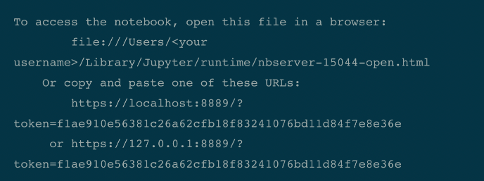
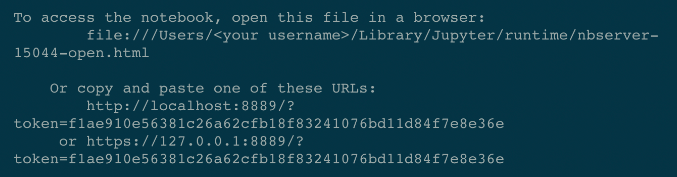

# How To Setup a Jupyter Notebook in VS Code (Virtual Env + Kernels)

## Step 1 - Create Project Folder

First you need a project folder, so create that - you can use Finder, Terminal, or do it in VS Code.

```
# syntax 
mkdir <folder name> 

# example
mkdir myproject
```

## Step 2 - Create & Activate Your venv
### Create
Navigate to / open your project folder and create a virtual environment inside of it.
```
# syntax
python3 -m venv <virtual environment name>

# example that would create a virtual environment named 'myenv'
python3 -m venv myenv
```
### Activate
Now activate the virtual environment and when VS CODE prompts you to set it as default for the project, hit yes.
```
# syntax
source <virtual environment name>/bin/activate

# example
source myenv/bin/activate
```


## Step 3 - Install ipykernel
Now that your virtual environment is activated, install ipykernel
```
pip3 install ipykernel
```


## Step 4 - Create A Kernel
Now you can create a new kernel to be used for your project:
```
# syntax
python3 -m ipykernel install --user --name=<projectname> 

# example that will create a kernel named 'myproject'
python3 -m ipykernel install --user --name=myproject
```


## Step 5 - Start Jupyter
Start jupyter by running the command jupyter notebook

If you did this right you should see something like this in your terminal:


## Step 6 - Trust & Select Your Kernel
Now you can assign the kernel to the project in VS CODE.

### Step 6.1: Create a new Jupyter notebook

Open the VSCODE search bar: cmd+shift+p
Type in & choose: “Create: New Jupyter Notebook”

### Step 6.2: Choose your kernel

Open the VSCODE search bar: cmd+shift+p
Type in & choose: “Notebook: Select Notebook Kernel”
At the bottom of VSCode, you should see “Jupyter Server: Local”

Click that, and a dropdown will appear.

Now, you will simply enter one of the URLs you received when you ran the Jupyter command back in Step 5:
