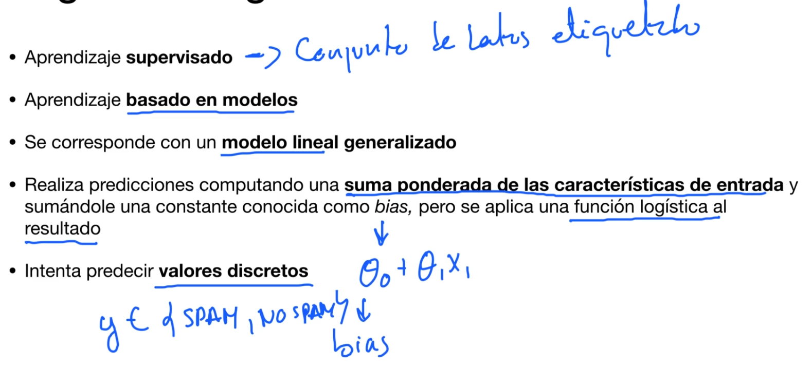
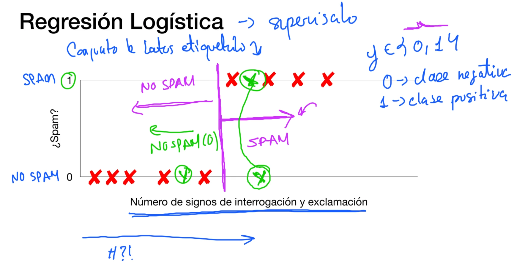
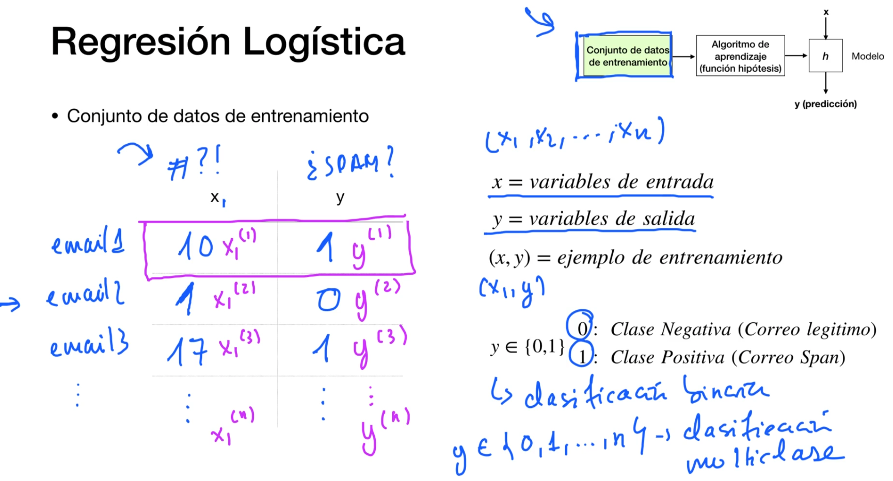
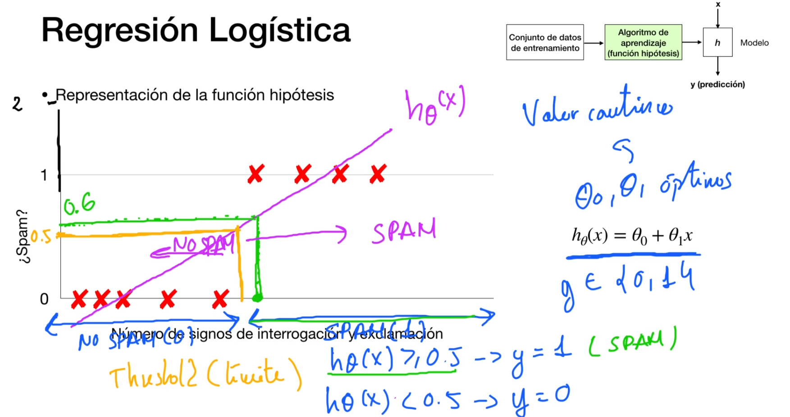
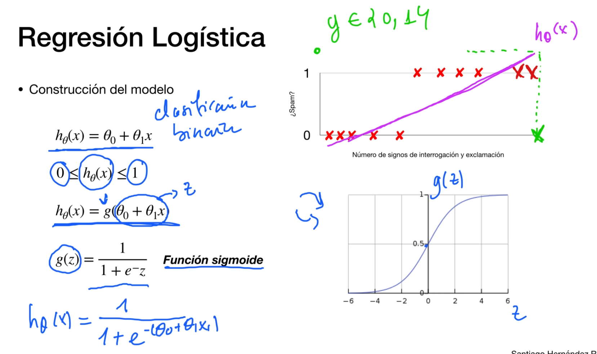
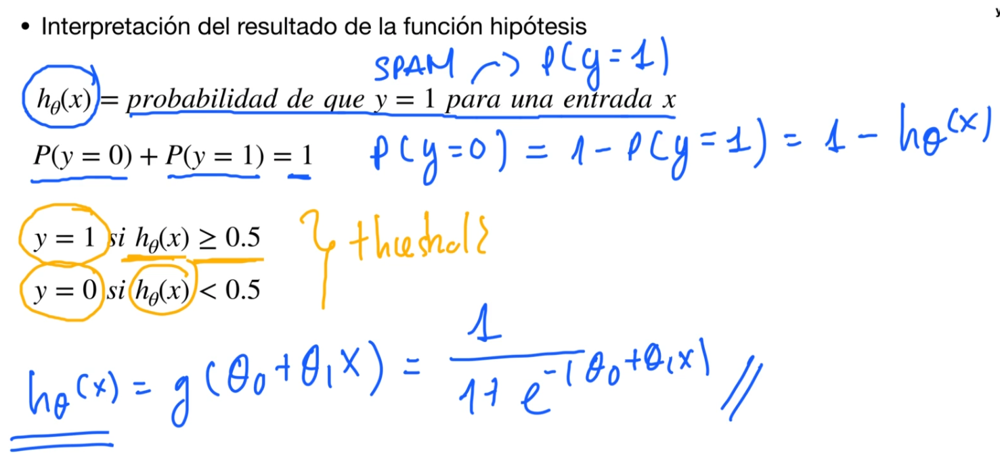
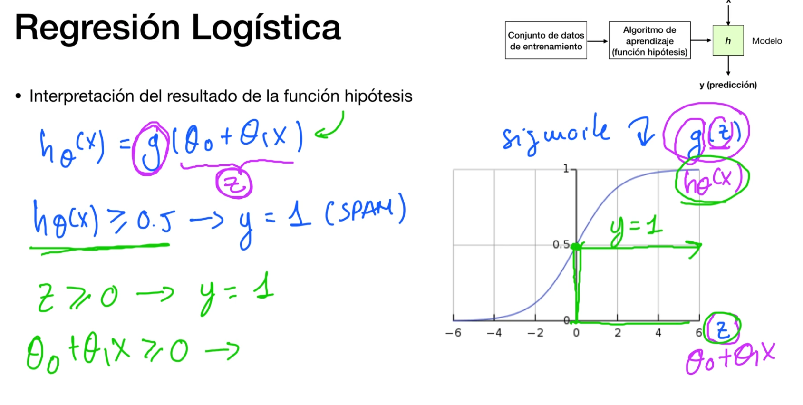
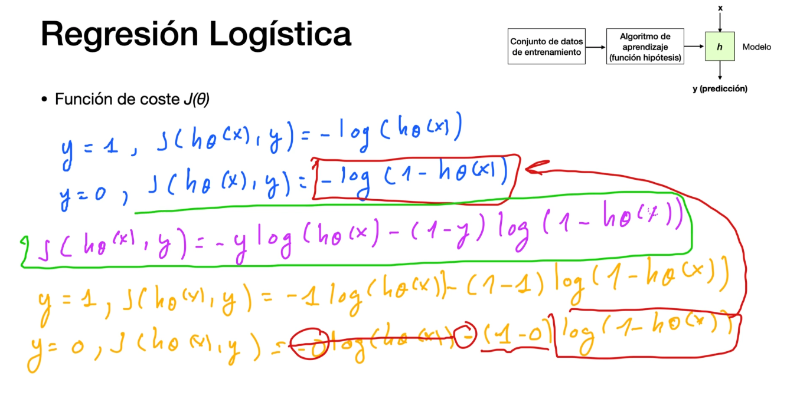
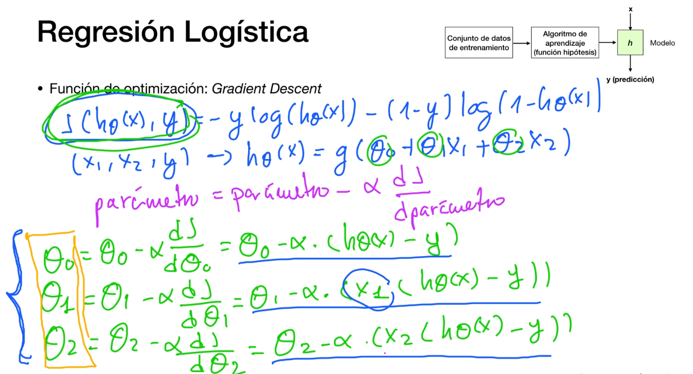
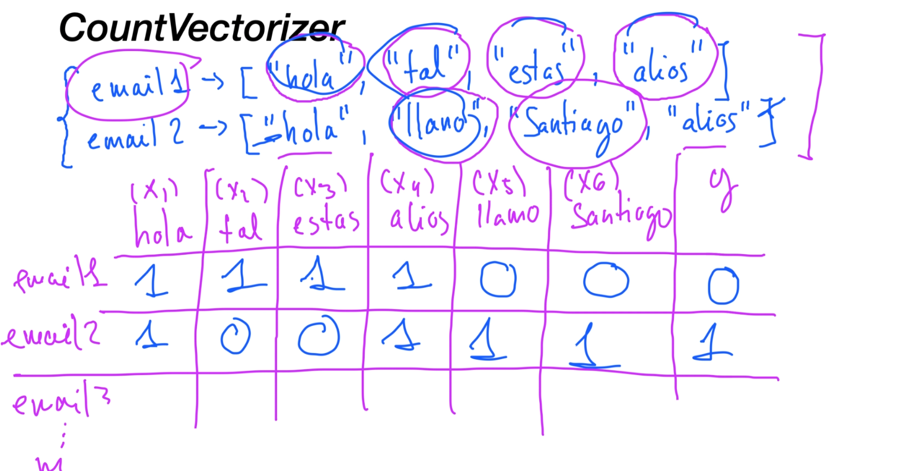

# Regresión Logística o Clasificación
Intentaremos predecir un valor discreto

Es supervisado!

Los problemas que se clasifican en 0 y 1 se llaman--> Clasificación binaria

Problemas de clasificación multiclase--> y {0,1,2,...,n}

regresion-clasificacion-logistica-3.png

## Representación de la función hipótesis
¡Por qué no se usa la regresión linean con threadshold!

Ojo, cuando tenemos dataset con valores alejados!, se nos aplana la pendiente de la función lineal y nos da falsos negativos

**Por esto mismo no se usa este métodos!!!!**

## Construcción del modelo

Función sigmoide!!!! g(z)

 
## Interpretacióm de la función Hipótesis

## Función de coste I

Se generan optimos locales, por lo que no se puede usar la función de coste de la regresion lineal para la funcion de coste de la regresion logística

## Función de coste II

Como podemos coger las 2 funciones de coste para lo positivo(spam) y negativo(no spam) y juntarlas en una única función

En morado tenemos la función conjunta de coste

En amarillo la resolición para cada y={0,1} y así vemos como se simplifica para los funciones de coste del apartado anterior.

## Función de optimización

Misma función que para regresión lineal: Gradient Descent

## Caso Práctico: Detector de SPAM

### CountVectorizer
una manera de transformar una representación en forma de texto, es decir, en este caso una representación en forma de palabras, a una representación numérica que nuestro algoritmo de Machine Learning sea capaz de comprender.

### OneHotEncoder

Pone nombres a las caracteriticas que tenemos (en este caso las palabras)
