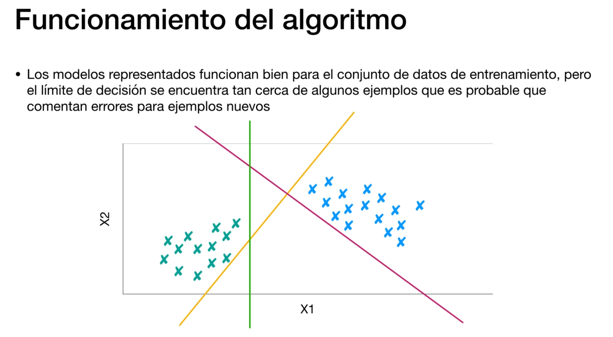
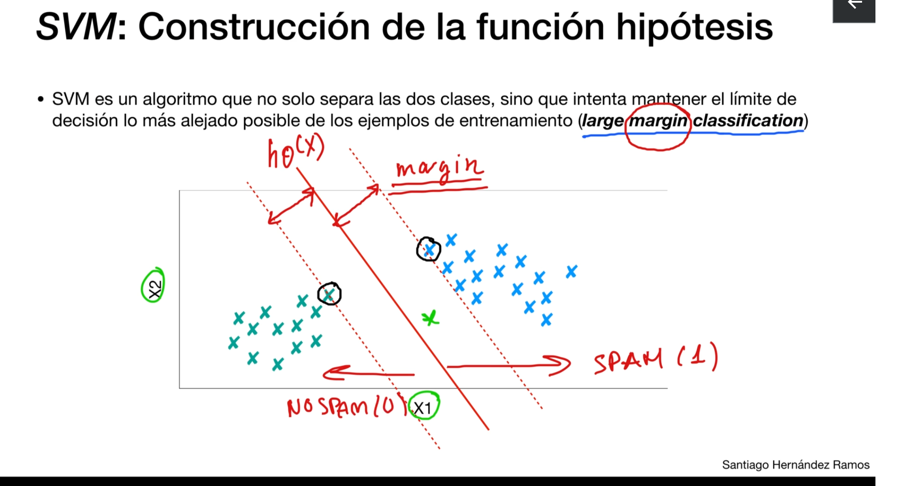
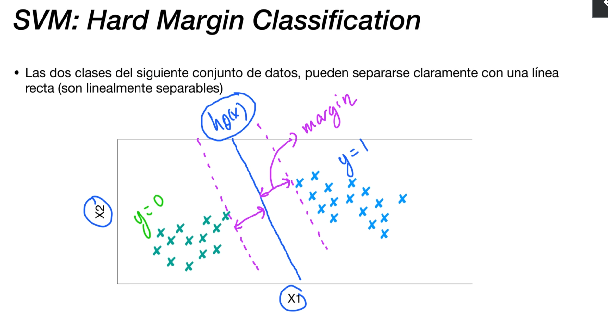
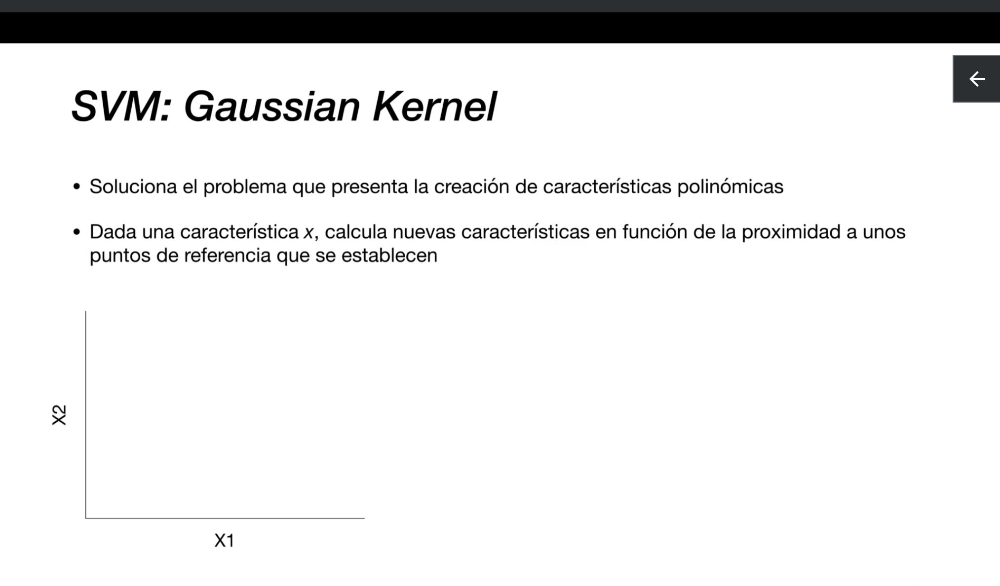

# Introducción

Nos permite hacer tareas de regresion y clasificacion

Funciona bien para conjuntos de datos pequeños y complejos

## Conjuntos de datos linealmente separables:

* En un conjunto de datos linealmente separable, es posible trazar un límite de decisión lineal que pueda separar perfectamente las diferentes clases.
* Un ejemplo clásico es cuando las dos clases de datos se pueden separar utilizando una línea recta en un plano bidimensional o un hiperplano en espacios de mayor dimensión.
* Los algoritmos de clasificación lineal, como la regresión logística o las máquinas de vectores de soporte (SVM) con un kernel lineal, son apropiados para conjuntos de datos linealmente separables.

## Conjuntos de datos no linealmente separables:

* En un conjunto de datos no linealmente separable, no es posible trazar un límite de decisión lineal que pueda separar perfectamente las clases.
* Se necesitan límites de decisión más complejos, no lineales, para separar las clases de manera efectiva.
* Algoritmos como las máquinas de vectores de soporte con kernel no lineal, redes neuronales con capas no lineales (como las capas ocultas con funciones de activación no lineales), y otros métodos no lineales pueden ser más apropiados para manejar conjuntos de datos no linealmente separables.

La naturaleza lineal o no lineal de un conjunto de datos influye en la elección del modelo de aprendizaje automático adecuado. En la práctica, muchos conjuntos de datos del mundo real no son linealmente separables, lo que hace que algoritmos más complejos sean necesarios para realizar tareas de clasificación de manera efectiva.

Para soluciona este problema, svm- large margin classification

# Hard Margin Classification

# Construcción del modelo lineal - Función Coste

Con la funcion sigmoide

**Hinge Loss** : Así se le llama a la función de error

# Construcción del modelo lineal - Función Hipótesis

Que pasa si ajustamos la h a lo siguiente:

Elegimos una nueva h para alejarse mas, hacer el error mas pequeño

Nueva h:

Resumen: aun cuando las h calculadas predecian correctamente, no estaban los suficientemente alejadas y nos generaban un error. Alejandonos tenemos error = 0 

# Soft Margin Classification

Para los support vectors que son anómalos, que tengan menos peso/influencia

A medida que vamos disminuyendo el valor del hiperparámetro C, vamos restando importancia o influencia en la construcción del modelo a esos ejemplo que se encuentran mas cerca del modelo,  vectores de soporte

# Kernels: Regresion Polinómica
Para conjuntos de datos que no se pueden separar linealmente

# Kernels: Gaussian Kernel

