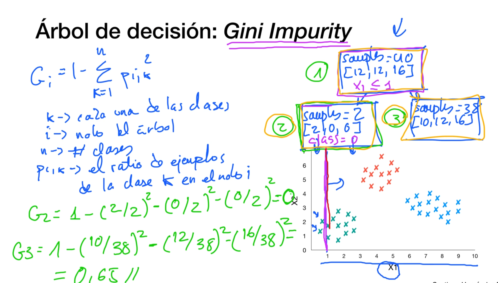

# Arboles de decisión

## Introducción

## Gini Impurity

## Entrenamiento del algoritmo

## Clasificación y función de coste

## Regresión y función de coste

## Limitaciones de los arboles de decisión

## Caso práctico: detección malware android

# Ensemble learning

## Bagging and Pasting

## Random Forests

## Boosting and Stacking

## Caso Práctico: detección malware android II

