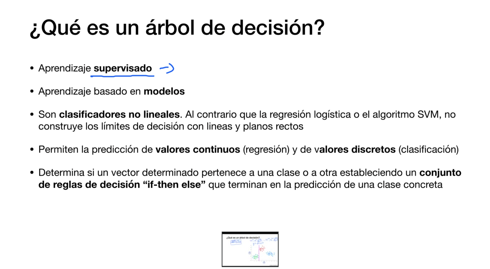
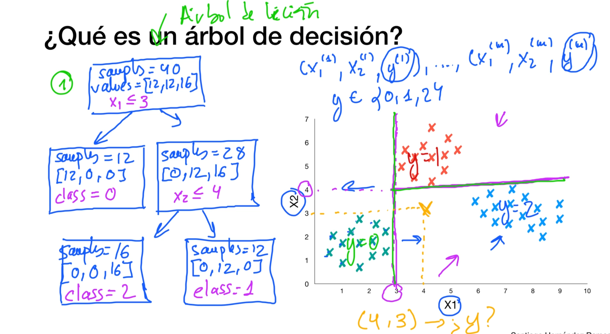
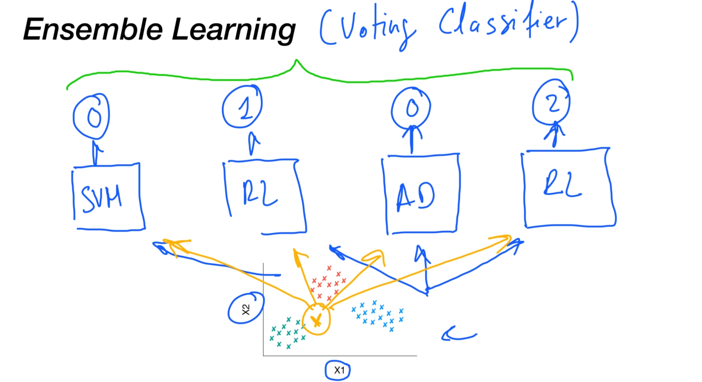

# Arboles de decisión

## Introducción

## Gini Impurity

## Entrenamiento del algoritmo

## Clasificación y función de coste
CART = Classification and Regression Tree

## Regresión y función de coste
mse= min square error

## Limitaciones de los arboles de decisión

## Caso práctico: detección malware android

# Ensemble learning and random forests

## Bagging and Pasting

## Random Forests

para clasificatiores se pueden usar n arboles y hacer una media de sus resultados!!!

## Boosting and Stacking

### Boosting
Generar modelos en los que tengamos en cuenta los casos que son mas dificiles de clasificar

Vamos generando modelos y regenerandolos pasandole en cada iteración mas importacia sobre ejemplos/valores que creemos que deberían tener mas importancia que las que el modelo actual les ha dado

### Stacking
Dividimos el conjuento de datos en 2:
* Conjunto de estimadores y entrenamos modelos
Una vez tenemos los modelos, usamos el conjunto 2 para ver la predicción que hacen y entrenar un nuevo modelo

## Caso Práctico: detección malware android II

## Preguntas

**Además del Gini Impurity, existe otro método bastante popular que puede utilizarse durante la construcción de los árboles de decisión, su nombre es la Entropía.
¿En qué casos de uso se recomendaría el uso de la Entropía respecto al Gini Impurity?**

Lo cierto es que utilizar la Entropía o el Gini Index no varía de manera sustancial la construcción de los árboles de decisión en la mayoría de los casos de uso prácticos. Tienes estudios muchos más teóricos que llegan a esta conclusión, como por ejemplo este: https://www.unine.ch/files/live/sites/imi/files/shared/documents/papers/Gini_index_fulltext.pdf.

Si te fijas, el articulo concluye con la siguiente afirmación: "Basándonos en estas caracterizaciones pudimos analizar la frecuencia de acuerdo/desacuerdo de la función del Índice de Gini y la función de Ganancia. Encontramos que están en desacuerdo sólo en el 2% de los casos, lo que explica por qué la mayoría de los resultados empíricos publicados anteriormente concluyeron que no es posible decidir cuál de las dos se desempeña mejor."

Teniendo esto en cuenta, existen algunos casos concretos en los que podría ser recomendable no utilizar Gini Index debido a que tiene la tendencia a aislar los ejemplos de la clase más frecuente en la misma rama del árbol, lo que suele provocar árboles bastante desbalanceados. Por otro lado, la entropía no tiene esta tendencia y produce árboles más balanceados. Por esto, en ocasiones puedes leer en la literatura que Gini esta más aconsejado para problemas con valores continuos y la Entropía para problemas con valores discretos.

**En casos de uso prácticos reales, ¿cuál de las dos métricas se utiliza más, el Gini Index o la Entropia? ¿Cuál es la razón?**

Realmente, por mi experiencia, lo más utilizado es Gini Index. Piensa que incluso los algoritmos de sklearn que implementan árboles y conjuntos de árboles implementan esta métrica por defecto: https://scikit-learn.org/stable/modules/generated/sklearn.ensemble.RandomForestClassifier.html.

La razón fundamental por la que esto es así, es que el Gini Index es más rápido de calcular que la Entropía, lo que provoca una mayor eficiencia del algoritmo en general. Sin embargo, tal y como he comentado en la sección anterior, para la mayoría de los casos de uso prácticos, no suele haber un diferencia significativa entre utilizar un métrica u otra.

**¿Cuándo es recomendable utilizar alguno de los métodos de Ensenble Learning, como Staking, Boosting, Pasting o Bagging?**

Tanto Bagging como Pasting es muy frecuente utilizarlos incluso para la solución de problemas reales debido a que muchos algoritmos existentes se fundamentan en estas técnicas. En este curso vemos dos muy importantes, Random Forest e Isolation Forest. El resto de técnicas de Ensemble como Boosting, también pueden utilizarse con relativa frecuencia si se usan algoritmos que las implementan como AdaBoost. Sin embargo, el uso de estas técnicas para agrupar predictores personalizados generado tu propia arquitectura, no suele ser frecuente y las veces que se usa, suele ser en casos en los que se desea obtener una mejor predicción para un momento concreto, sin importar otros factores como el rendimiento. Un ejemplo claro puede ser una competición de kaggle. Por esta razón, algunas de las técnicas, como Stacking, ni siquiera están soportadas directamente en sklearn.