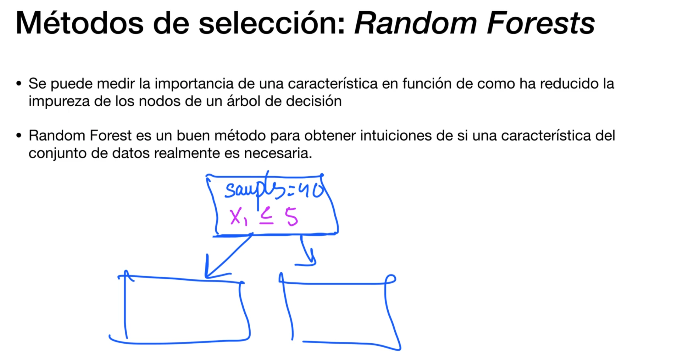

# Selección y Extracción de características

## Caso Práctico: Selección del modelo

Ese problema de selección de los hiper parámetros óptimos se denomina el problema de selección del modelo

## Selección características
Reducir la dimensionalidad del conjunto original

## Caso Práctico: Selección características

## Extracción características

## Caso Práctico: Extracción características - PCA

## Preguntas frecuentes
**Tal y como se indica en otras secciones de este curso, existen diferentes técnicas de escalado del conjunto de datos. ¿Cuándo es recomendable utilizar normalización y cuándo es recomendable utilizar estandarización?**

La normalización básicamente consiste en escalar los valores de una variable de manera que queden comprendidos entre 0 y 1. Puede ser útil en problemas en los que algunas carácteristicas de entrada deben recibir valores positivos dentro de la misma escala. Esto ocurre en algunos algoritmos como algunos tipos de Redes Neuronales. Sin embargo, existe un problema conocido, al escalar todos los valores entre 0 y 1 este tipo de técnicas tienden a afectar negativamente a los valores anómalos, lo que puede ser un problema para algunos tipos de algoritmos como los basados en detección de anomalías (se presentan más adelante en el curso).

La estandarizacion se refiere a escalar los datos de manera que tengan una media de 0 y una desviación estándar de 1. Esto quiere decir que los valores resultantes no se encuentran dentro de un rango, lo que provoca que mantenga mucho mejor los ejemplos anómalos del conjunto de datos. Por esta razón, suele ser el método preferido y más utilizado a la hora de realizar escalado del conjunto de datos.

**¿El algoritmo PCA debe aplicarse al conjunto de datos antes o después de realizar la codificación de las variables categóricas?**

Realmente el algoritmo PCA puede aplicarse tanto antes como después de aplicar la codificación de las variables categoricas. Sin embargo, el algoritmo PCA esta diseñado para aplicarse a variables continuas, lo que quiere decir que, si lo aplicamos a las variables resultantes de la codificación (que reciben valores discretos {0,1}) los resultados de PCA no serán tan significativos como si fueran variables continuas. Por lo tanto, mi recomendación en este aspecto es aplicar el algoritmo PCA a aquellas variables continuas del conjunto de datos y después aplicar codificación a las variables categóricas.