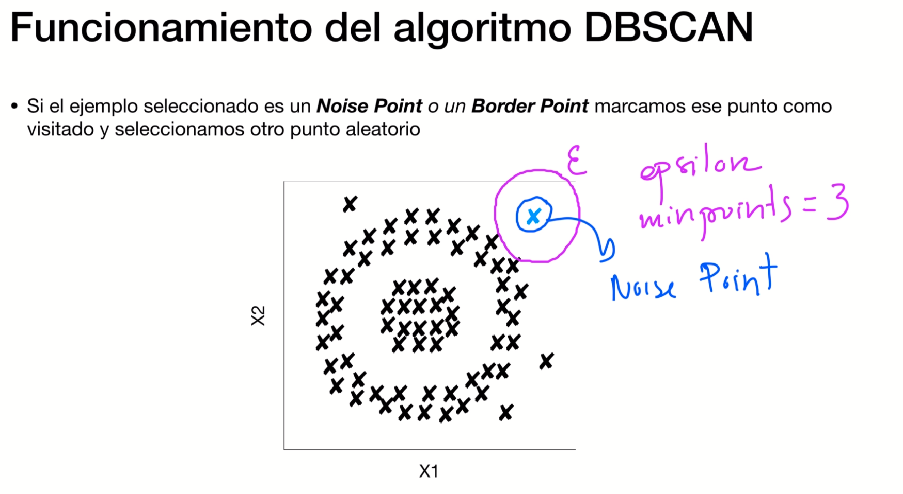
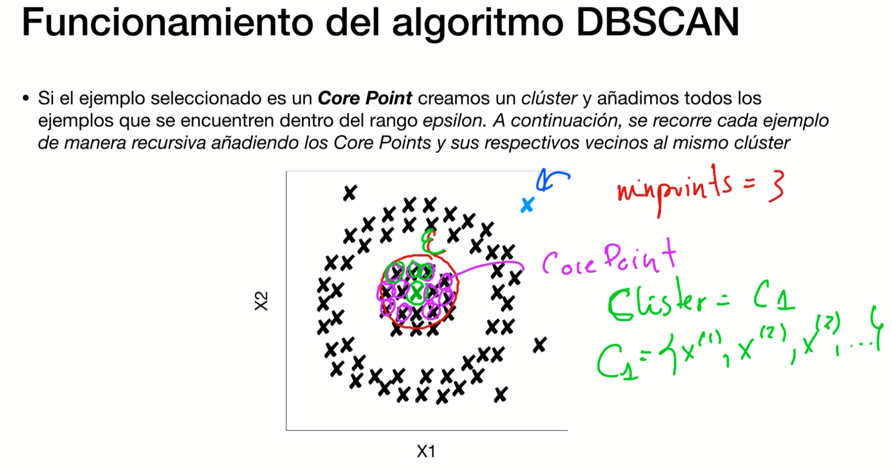

# Algoritmos de Clustering

## ¿Que es el clustering?
Dentro de las tecnicas NO SUPERVISADAS!

## Técnica de Clustering: KMEANS

inicial mente los centroides de eligen aleatoriamente
Mu1 y mu2

Se utiliza la **distancia euclidea** para saber a que clister pertenecee

Si tenemos que decidir el numero de centroides, esto quiere decir que tendremos que "orientarle" nosotros con el numero de clusters que va a crear

PROBLEMA CON DATOS NO ESFERICOS!

## Técnica de Clustering: DBSCAN
Si kmeans se basa en distancias, DBSCAN se basa en densidades

## Evaluación de los resultados de Clustering

## Clustering y Ciberseguridad

