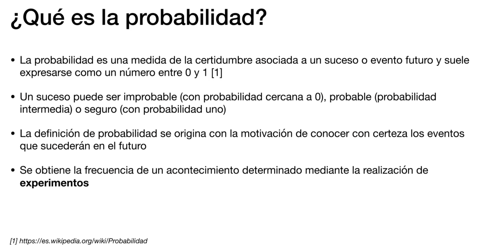
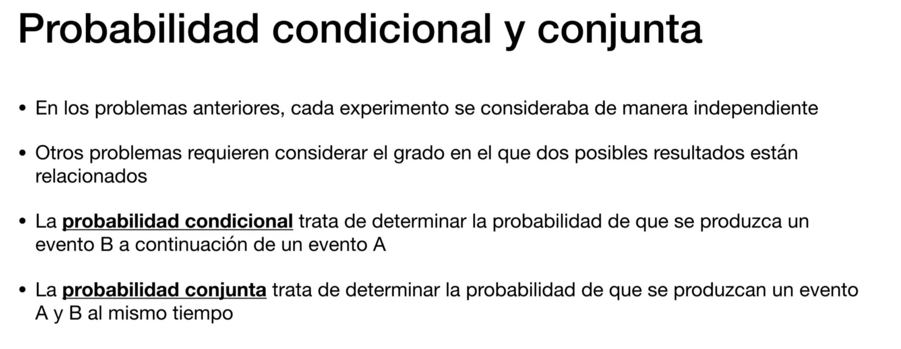
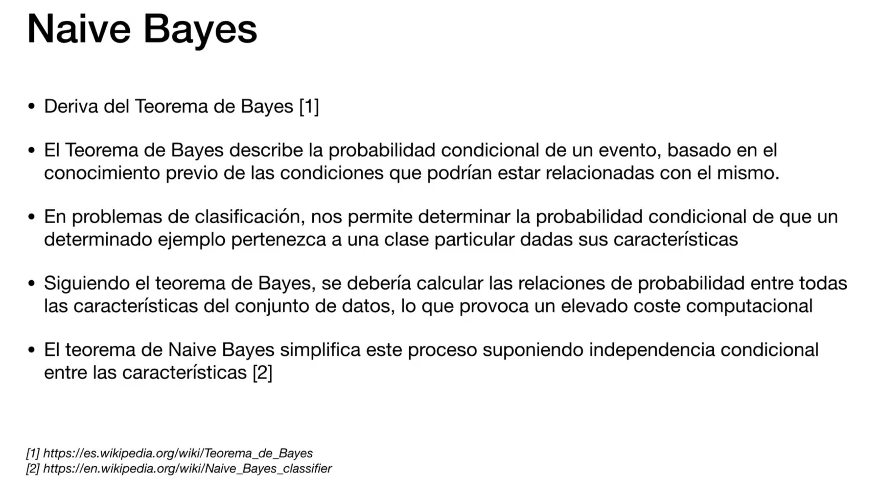
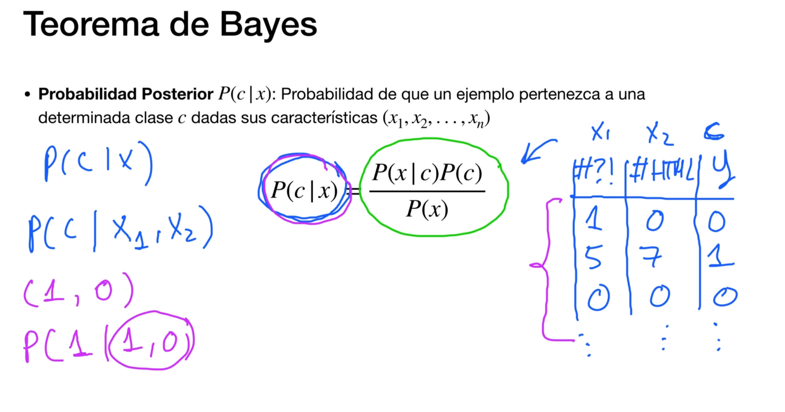
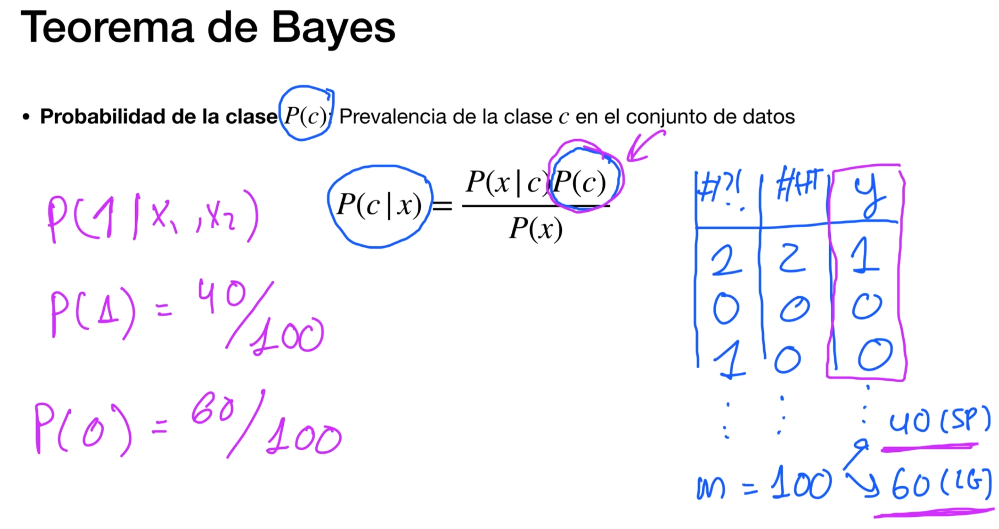
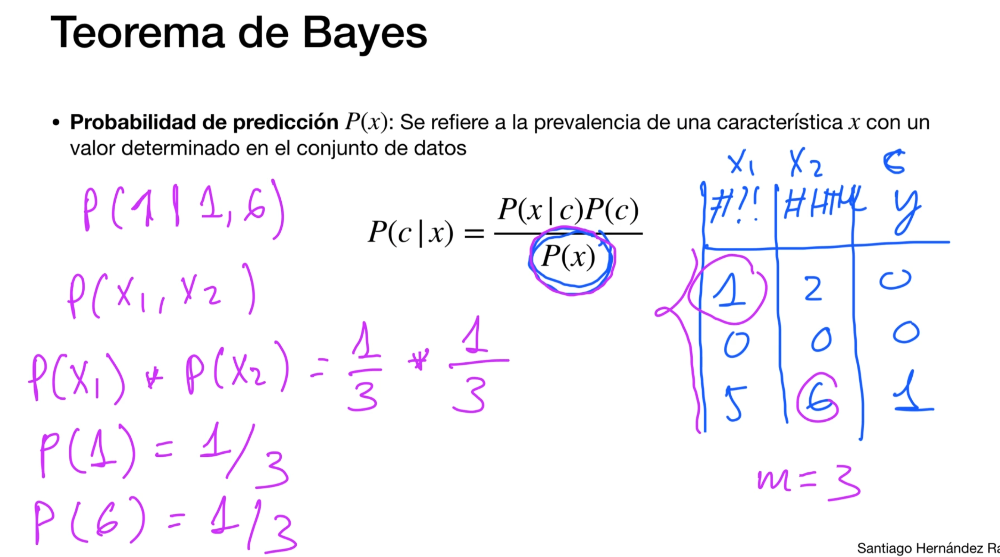
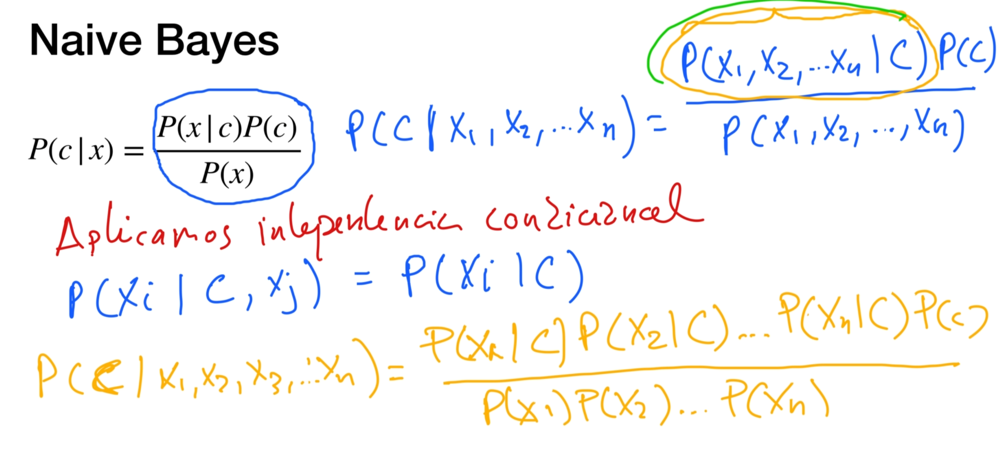
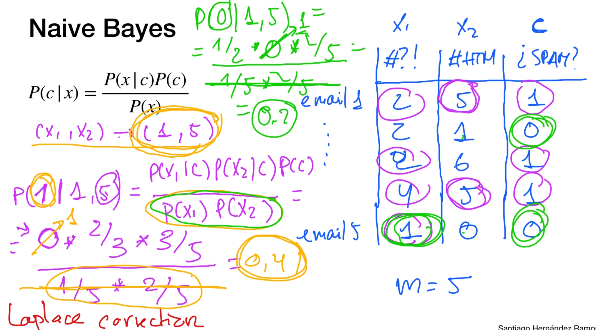
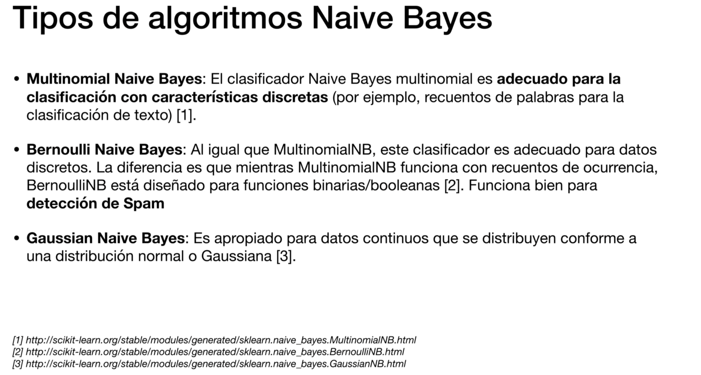

# Algoritmos de ML basados en probabilidad

## ¿Que es la probabilidad?

## Naive Bayes: Introducción
Para un conjunto de datos supervisado!!!!

## Funcionamiento del teorema de Bayes

## Funcionamiento del algoritmo de Naive Bayes

