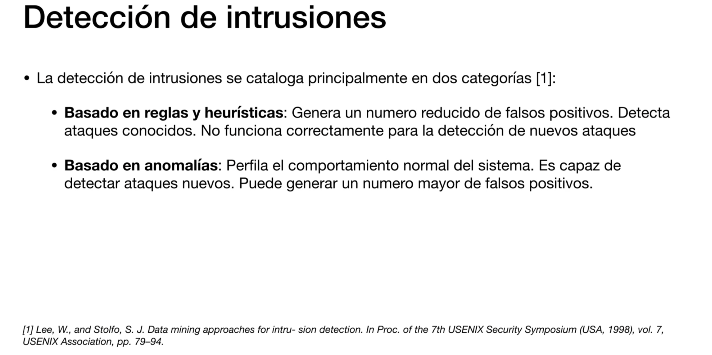

# Algoritmos de ML para detección de anomalías

## ¿Que es la detección de anomalías?

## Distribución Gaussiana: Intro

## Distribución Gaussiana: Estimación de los parámetros

## Distribución Gaussiana: Funcionamiento del algoritmo

## Distribución Gaussiana: Selección del threshold

## Distribución Gaussiana Multivariante

## Isolation Forest: Intro

## Isolation Forest: Funcionamiento del algoritmo
La teoria dice que las anomalias se van a quedar aisladas mucho antes que los valores positivos (esto es a medida que se baja en el arbol de decision)

Entiendo que las muestras en el fondo del arbol son positivas, y las muestras que quedan arriba del arbol son anomalias

Por lo que el valor de corte, será algo así como a partir de que profundidad del arbol, las muestras dejan de ser anómalasa

## Isolation Forest: Construcción del modelo

