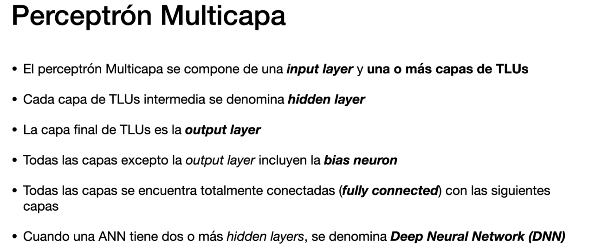

# Redes Neuronales Aritficiales y Deep Learning

## Introducción a las Redes Neuronales Aritficiales

## Perceptron: Redes Neuronales Aritficiales y construcción del modelo

## Perceptron multicapa

## Aprendizaje RNA: Gradient Descent y Backpropagation
## Gradient descent
### Gradient descent y regresion logística

### ¿Que significa Gradiente?

### Gradient descent y regresion logística

## BackPropagation

mu=learning rate

se van realimentando hasta que los paramtros de w1,w2 y b no varien

## Tipos de redes neuronales

En las de tipos convolucionaes, no todos los outputs se conectan con todos los inputs de la siguiente capa
Las ultima capa si que es fully connected

Para reconocimiento de texto, alaisis sintactico, semantico, etc...: 

