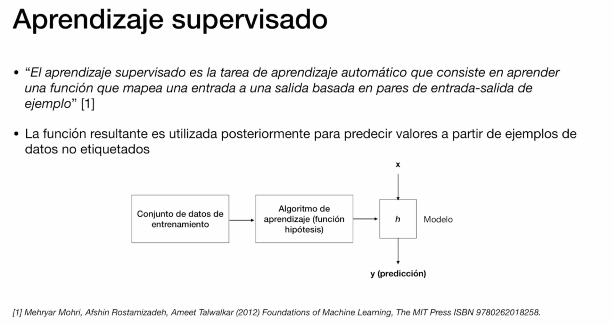
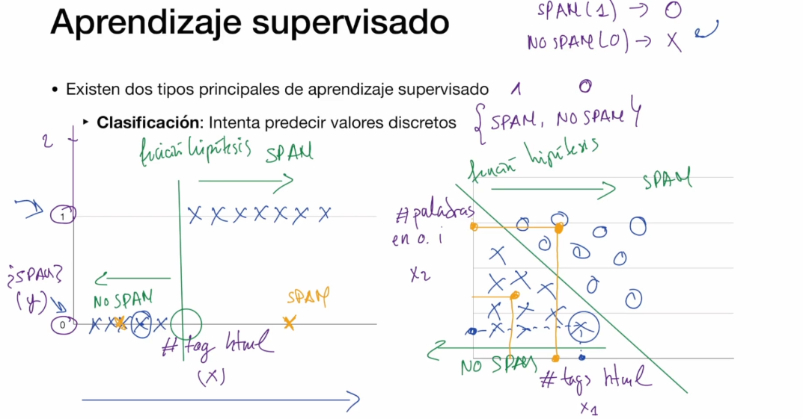
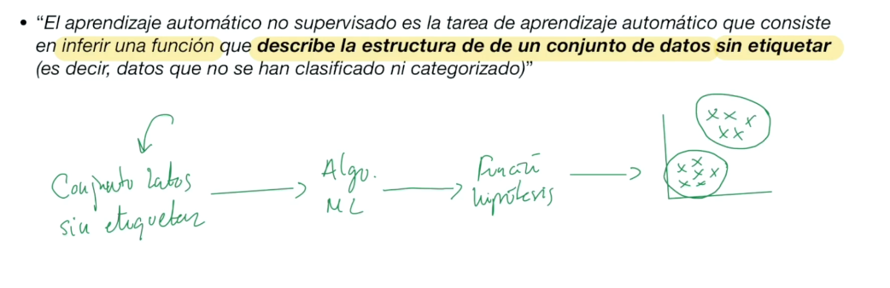
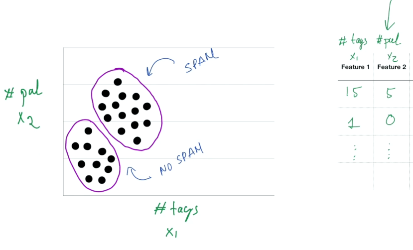
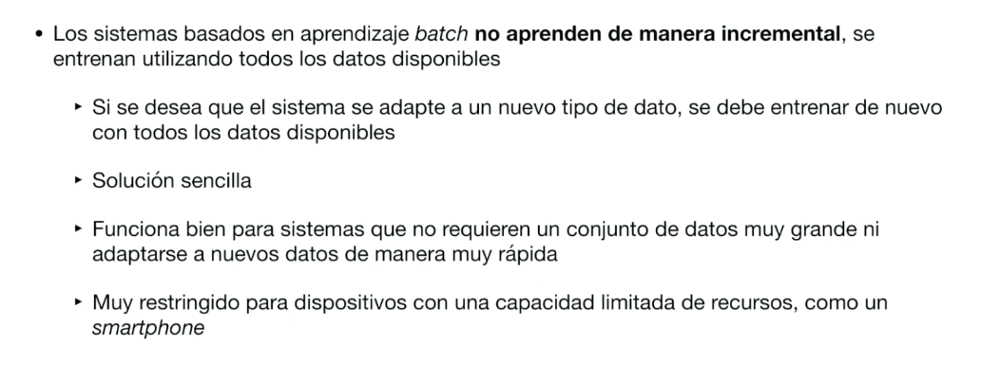
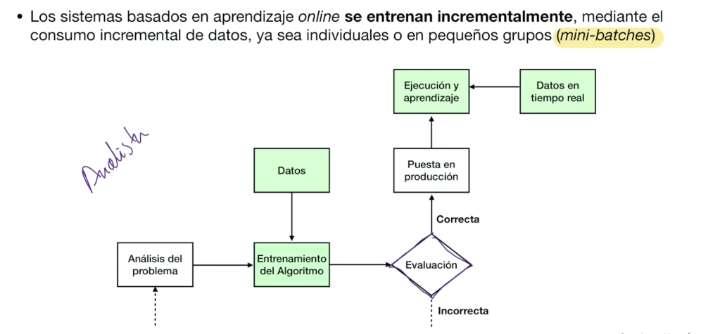
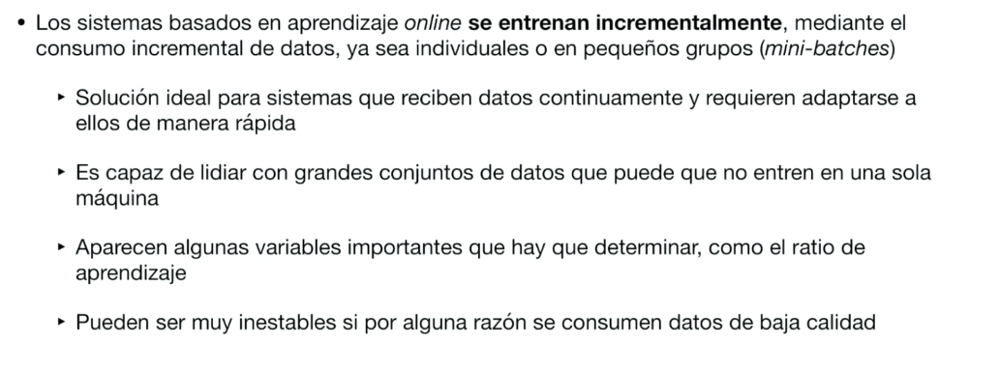
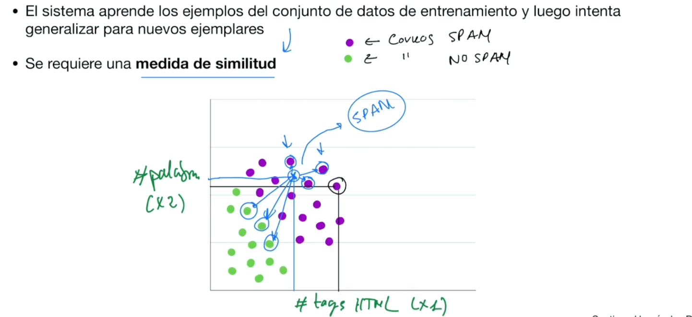
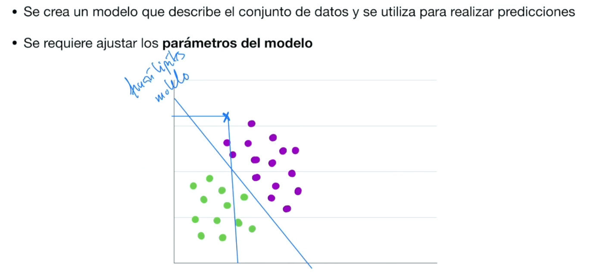

# Clasifiación de los sistemas de ML

- En función de la manera en que se entrenan:
    - Aprendizaje supervisado
    - Aprendizaje no supervisado
    - Aprendizaje semi-supervisado
    - Aprendizaje reforzado

- En función de la manera en que aprenden en el tiempo:
    - Aprendizaje online
    - Aprendizaje batch

- En función de la forma en que se realizan las predicciones:
    - Aprendizaje basado en instancias
    - Aprendizaje basado en modelos

## Aprendizadje Supervisado

Conjunto de datos de entrenamiento: tiene etiquetas: Es spam o no es spam

h: función hipotesis

### 2 Tipos de aprendizaje supervisado:

#### Regresion:
Intenta predecir **valores continuos**

#### Clasificación:
Intenta predecir **valores discretos**
Construye un modelo: es la h

## Aprendizadje No Supervisado
Inferir una función que describe la estructura de un conjunto de datos **sin etiquetar** (datos sin clasificar ni categorizar)
Inferir: Deducir algo o sacarlo como conclusión de otra cosa.
Lo que hará la función hipótesis (h) será describir la estructura de los datos sin etiquetar

El objetivo es que un analista despues de que se generé la función, pueda ver los subconjuntos que la h genera para validarlos.

Este tipo de aprendizaje es bueno cuando tenemos ingentes cantidades de datos, lo que hace que su categorización inicial sea casi imposible para realizar por gente.

## Aprendizadje Batch
No aprenden de manera incremental, se usan todos los datos disponibles, entrenamos el modelo y nos genera una función h. 
Y entonces usando otros datos que no estaban en el conjunto inicial, evaluamos nuestro algoritmo h.

## Aprendizadje Online
Se envia un conjunto inicial para entrenar el modelo, si vemos que va bien, lo ponemos en produccíon.
A mendida que llegan nuevos datos en tiempo real, si vemos que las predicciones son buenas, usamos esos mismos datos para reentrenar el modelo.

Para la entrada de datos en tiempo real, hay que poner una etapa de filtrado, para normalizar datos, eliminar alguna muestra, etc...

## Aprendizadje basado en instancias

## Aprendizadje basado en modelos

 