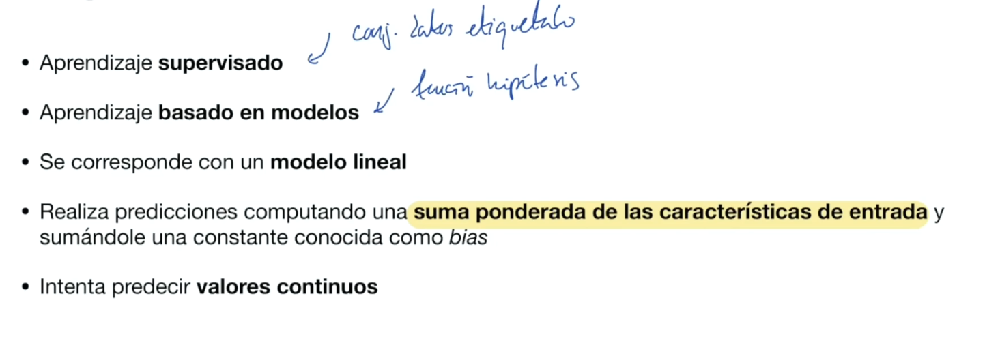
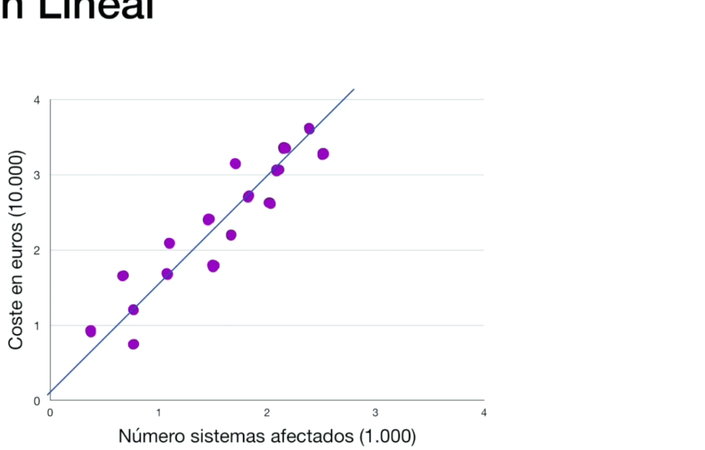
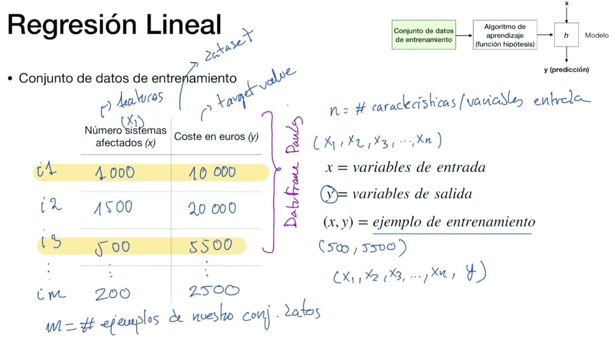
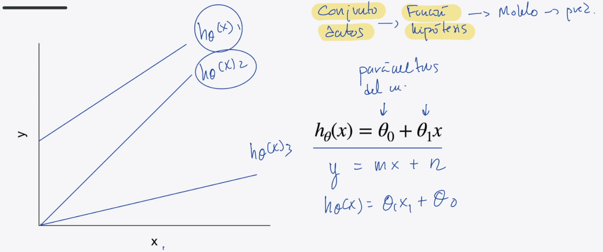
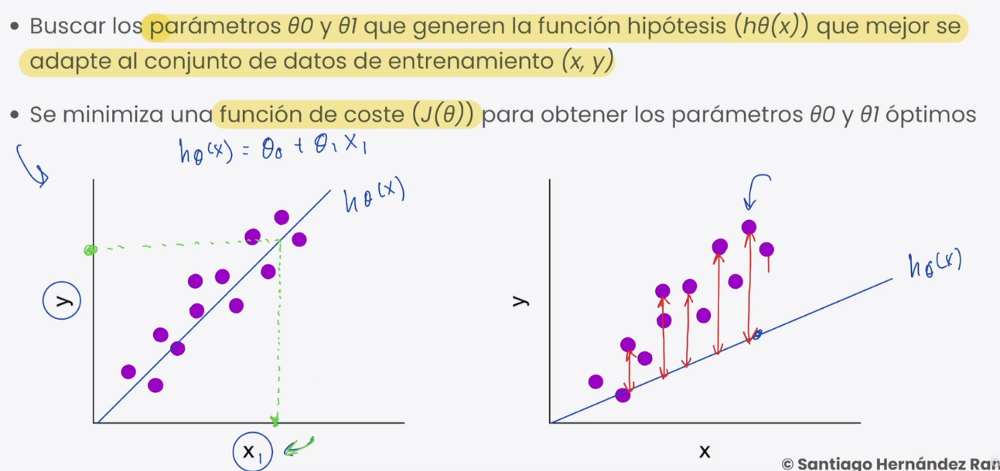
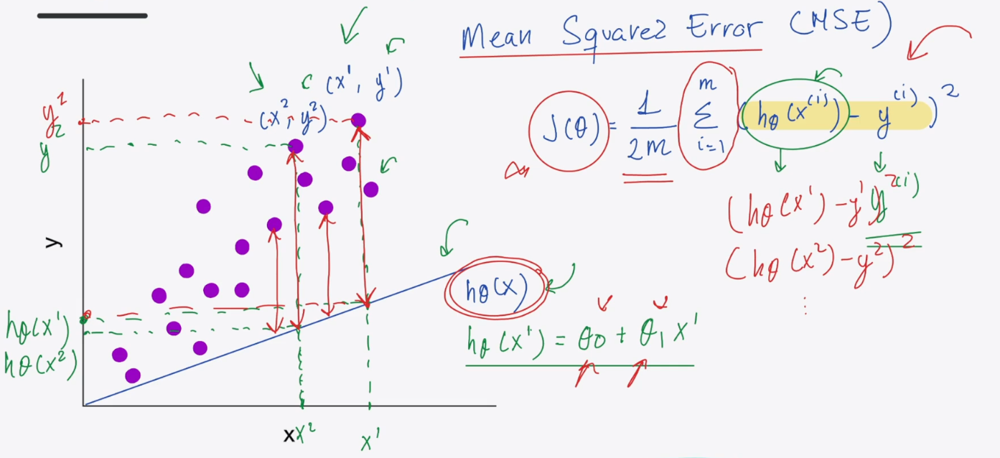
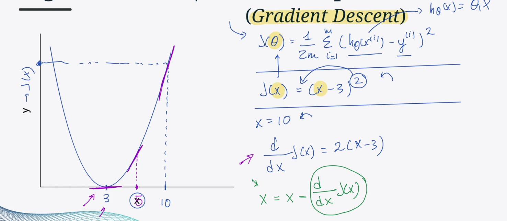
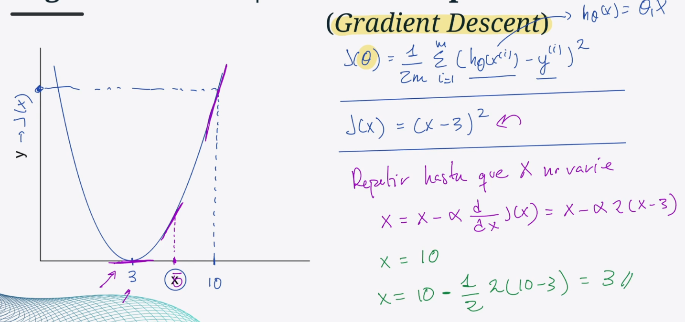
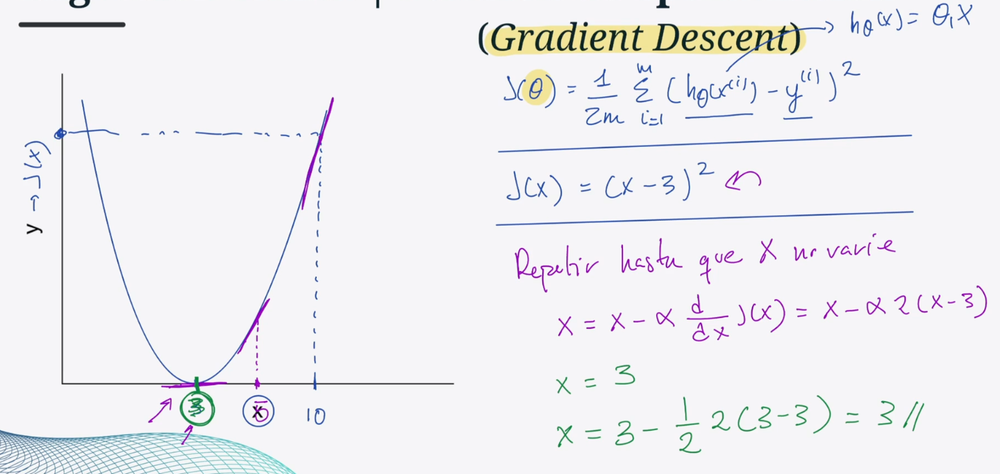
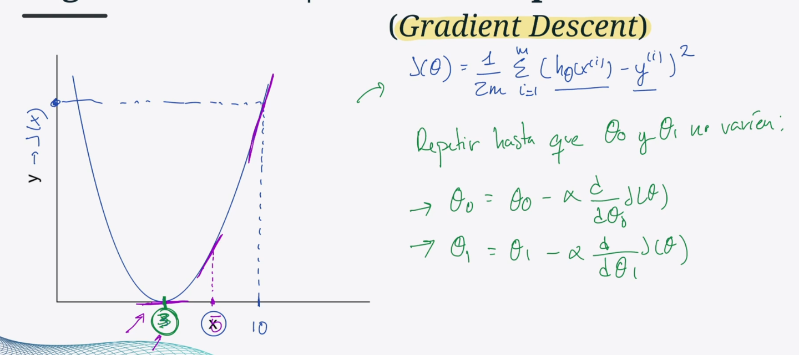

# Regresión Lineal

Caracteristicas de entrada: features
Caracteristicas de salida: target
Conjunto de datos: dataset

x1, x2, x3,... diferentes caracteristicas o variables de entrada

## Función hipótesis

Si solo tenemos una característica de entrada --> Regression linean univariable

Si tenemos varias: regresion linean multi variable

y(x1,x2,...,xn)= o0 + o1*x1 + o2*x2 + ... + o2*xn

## Construcción del modelo

## Función de coste

**Mean Square Error (MSE)**

## Función de optimización

**Gradient descent**

Su objetivo es minimizar el resultado de la función de coste/error

alfa = learning rate
El learning rate se suele poner a 0,5 (1/2)

Hemos obtenido 3, vamos a repetir el proceso con x=3

Lo hacemos para teta0 (o0)y teta1 (o1)

## Jupyter Notebook 4
Haremos el ejemplo de dicho notebook

# Links
[Linear Regression Reference](https://scikit-learn.org/stable/modules/classes.html#module-sklearn.linear_model)
