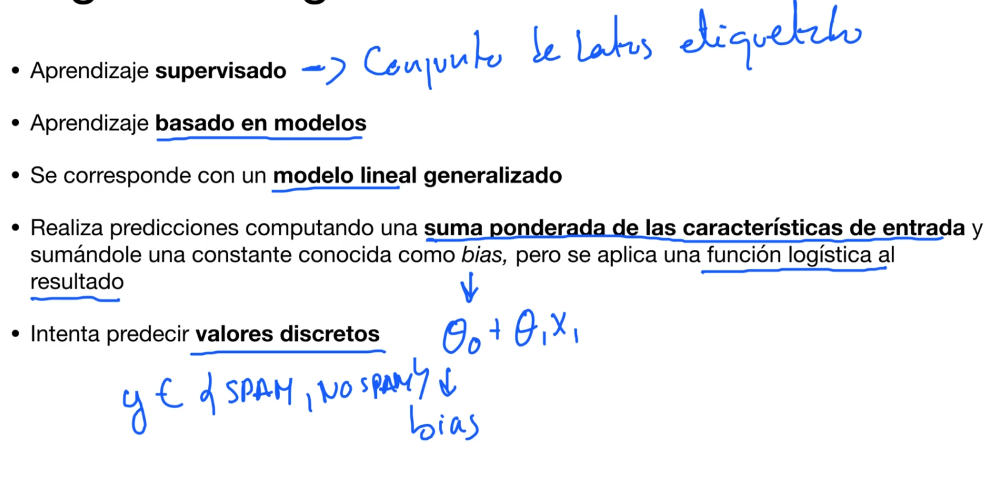
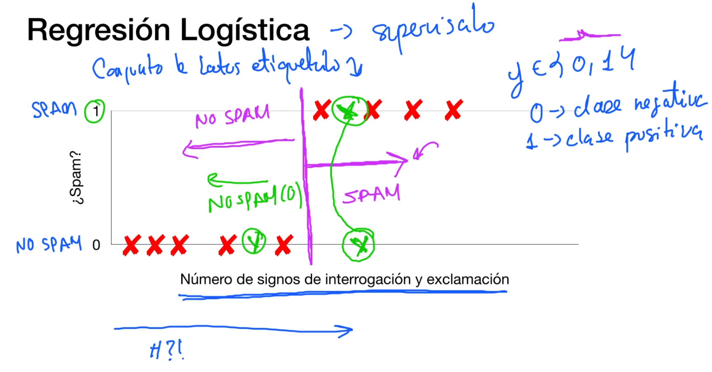
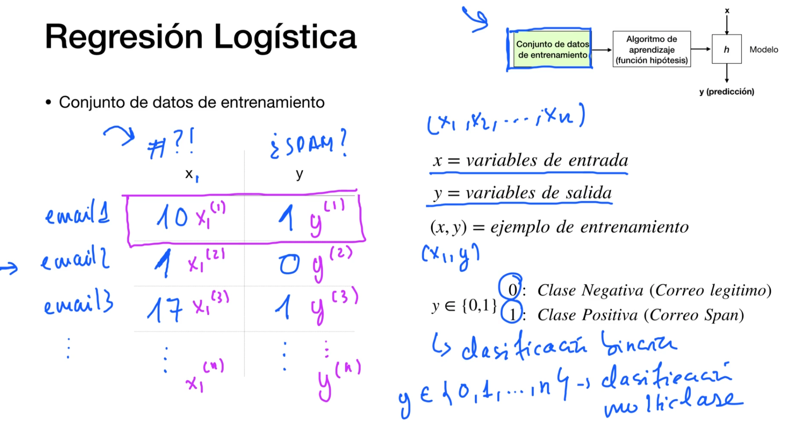
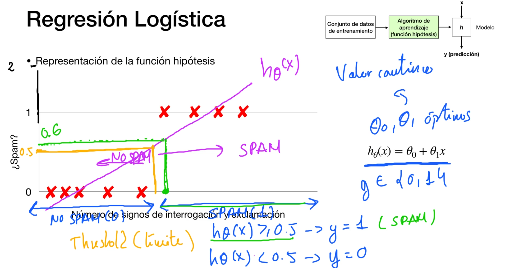
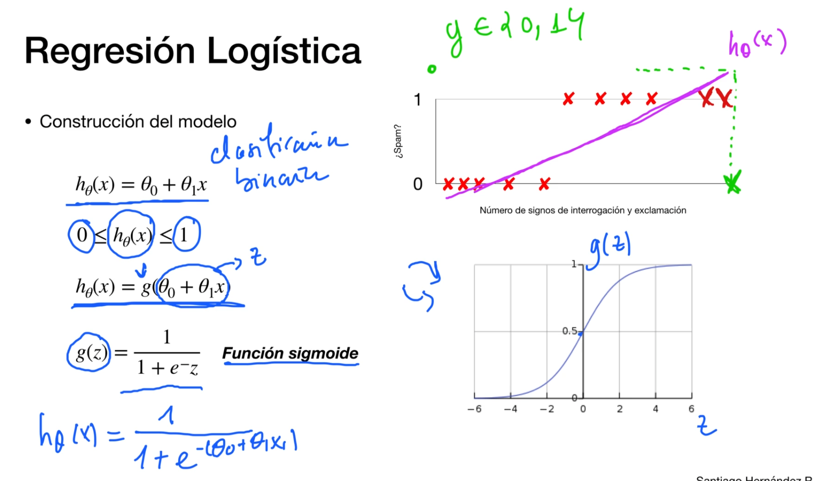

# Regresión Logística o Clasificación
Intentaremos predecir un valor discreto

Es supervisado!

Los problemas que se clasifican en 0 y 1 se llaman--> Clasificación binaria

Problemas de clasificación multiclase--> y {0,1,2,...,n}

regresion-clasificacion-logistica-3.png

## Representación de la función hipótesis
¡Por qué no se usa la regresión linean con threadshold!

Ojo, cuando tenemos dataset con valores alejados!, se nos aplana la pendiente de la función lineal y nos da falsos negativos

**Por esto mismo no se usa este métodos!!!!**

## Construcción del modelo

Función sigmoide!!!! g(z)

 
## Interpretacióm de la función Hipótesis

## Función de coste I

Se generan optimos locales, por lo que no se puede usar la función de coste de la regresion lineal para la funcion de coste de la regresion logística

## Función de coste II

regresion-clasificacion-logistica-interpretación-funcion-coste-II-1.png

regresion-clasificacion-logistica-interpretación-funcion-coste-II-2.png

## Función de optimización

regresion-clasificacion-logistica-interpretación-funcion-optimizacion-1.png

