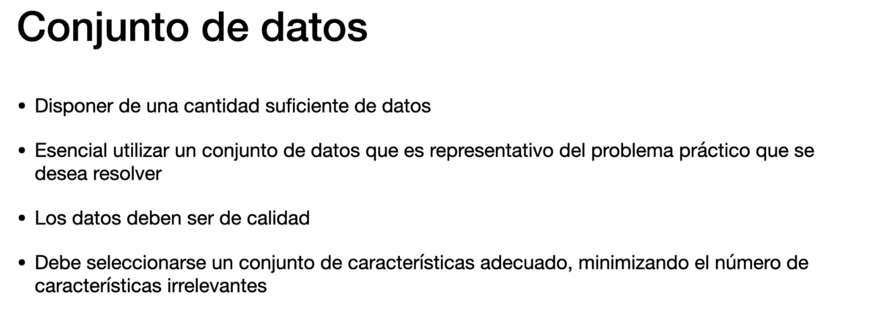
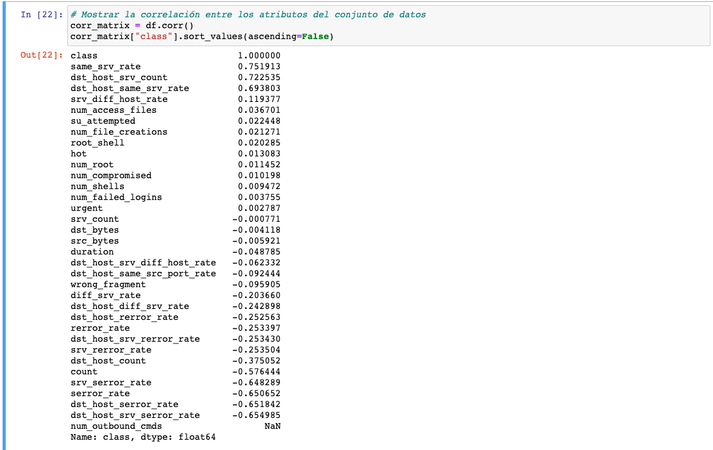
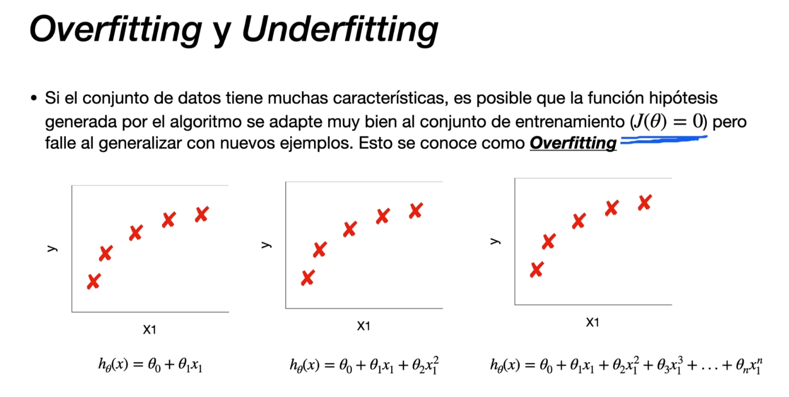
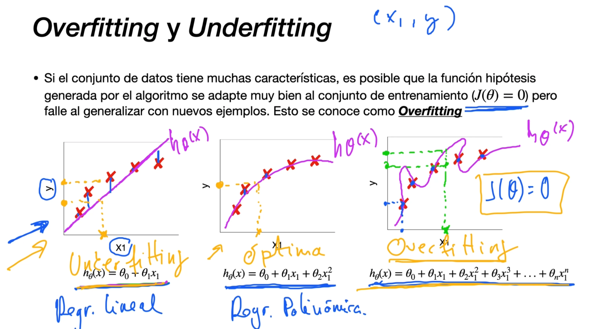
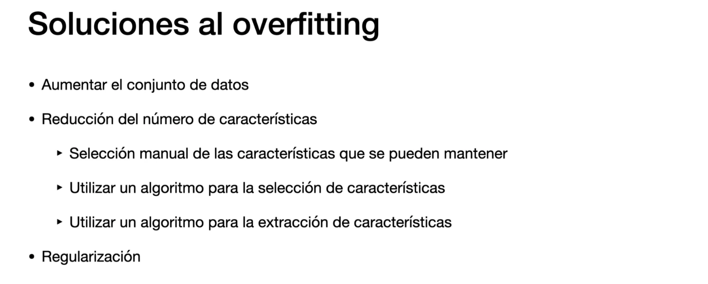
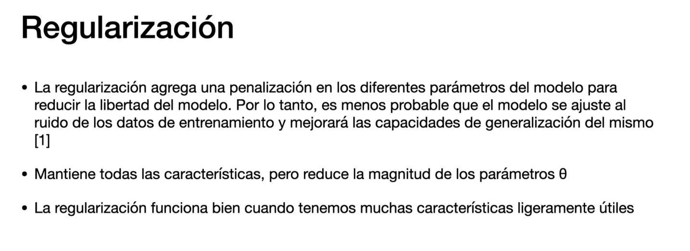
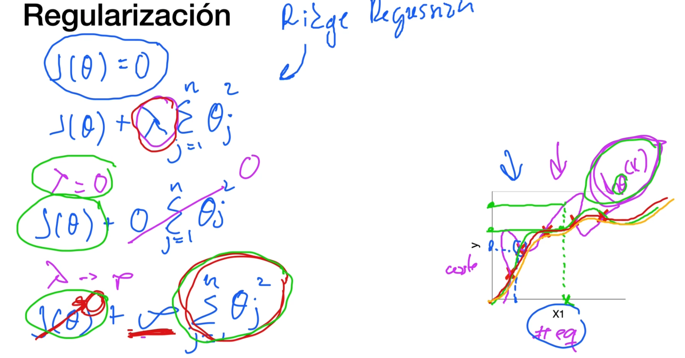
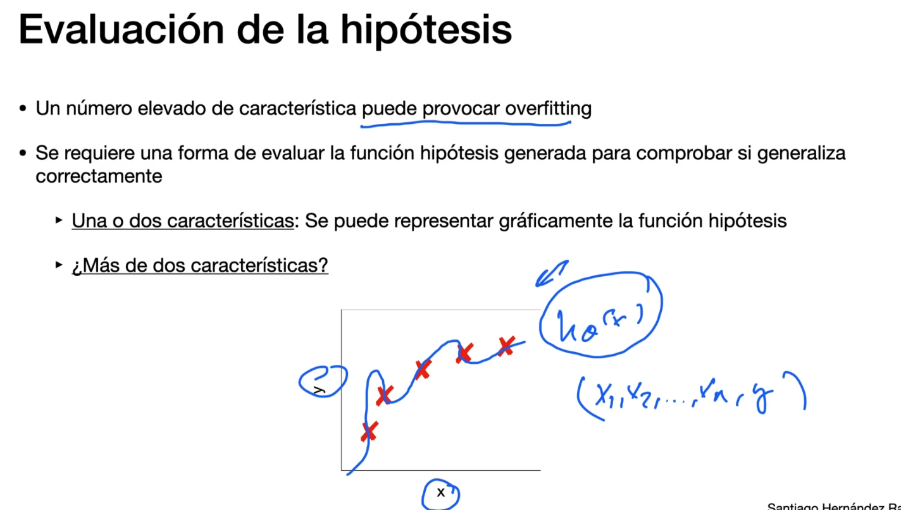
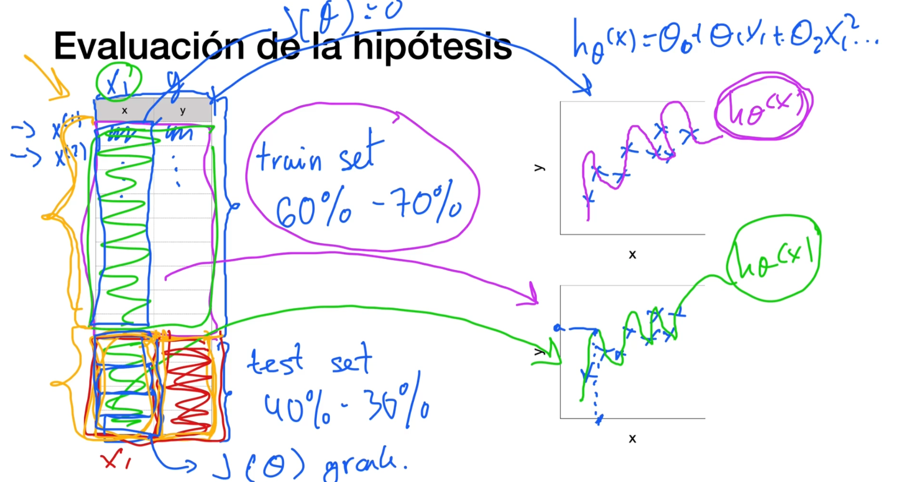

# Conjunto de datos


# Visualización del conjunto de datos
Notebook: 6_Visualización del conjunto de datos

Clasificar tráfico de red como anómalo o legítimo

## Buscando correlaciones
* Se puede calcular el coeficiente de correlación estándar para ver la correlación entre cada par de atributos
* El coeficiente de correlación, solo mide correlaciones lineales, esto quiere decir que si x va hacia arriba, mediría si y va hacia arriba o hacia abajo.
* Hay que intentar buscar correlaciones sobre todo con el atributo objetivo (el que queremeos predecir), en este caso class

```python
# Transformamos los valores del atributo class de categoricos a numéricos
from sklearn.preprocessing import LabelEncoder 
labelencoder = LabelEncoder()
df["class"] = labelencoder.fit_transform(df["class"])
df
```


Vemos que tenemos carácteristicas que tienen correlación con la 'class' y otras que no. (en la captura viene ordenado por las que tienen mas correlación)


# Overfitting y underfitting

Overfitting = sobreentranamiento



Regresion lineal
Regresion polinómica



# Soluciones al overfitting



## Regularización


* Ridge Regression: Lambda : Le añadiamos a la función de error una penalización: Es una constante



Hay que buscar un valor de lambda aceptable


# Evaluación del la función hipótesis
Como saber, de manera programática, si la eleccion del numero de caracteristicas a entrenar produce overfitting



Dividir nuestros conjuntos de datos:
* Unos para entrenar
* otros para evaluar




# Selección del modelo


# Caso Práctico: División del conjunto de datos

# Preparación del conjunto de datos


# Caso Práctico: Preparación del conjunto de datos

# Caso Práctico: Creación de Pipelines y Transformadores

# Evaluación de los resultados

# Caso Práctico: Evaluación de los resultados


