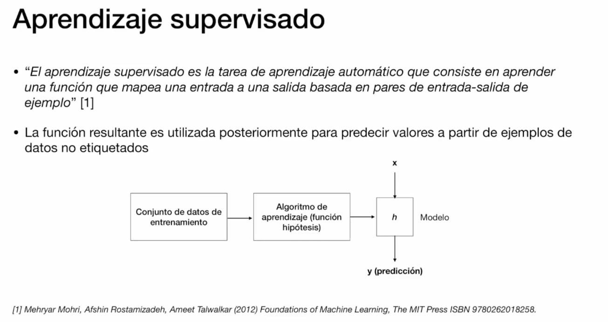
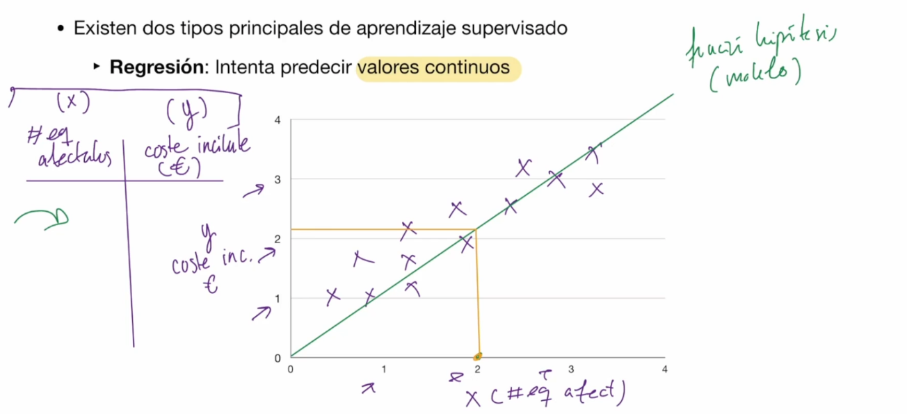

# Clasifiación de los sistemas de ML

- En función de la manera en que se entrenan:
    - Aprendizaje supervisado
    - Aprendizaje no supervisado
    - Aprendizaje semi-supervisado
    - Aprendizaje reforzado

- En función de la manera en que aprenden en el tiempo:
    - Aprendizaje online
    - Aprendizaje batch

- En función de la forma en que se realizan las predicciones:
    - Aprendizaje basado en instancias
    - Aprendizaje basado en modelos

## Aprendizadje Supervisado

Conjunto de datos de entrenamiento: tiene etiquetas: Es spam o no es spam

h: función hipotesis

### 2 Tipos de aprendizaje supervisado:

#### Regresion:
Intenta predecir **valores continuos**

#### Clasificación:
Intenta predecir **valores discretos**

## Aprendizadje No Supervisado

## Aprendizadje Online

## Aprendizadje Batch

## Aprendizadje basado en instancias

## Aprendizadje basado en modelos

